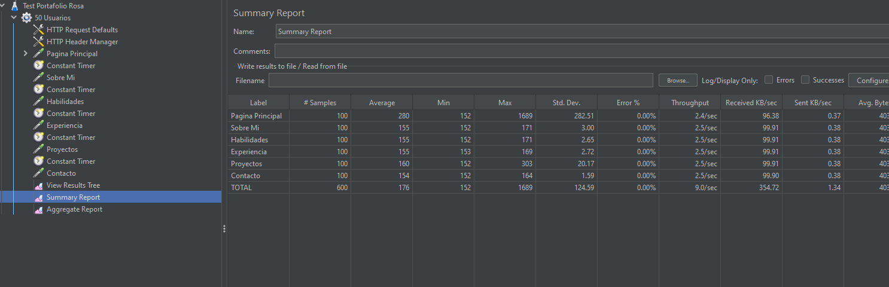
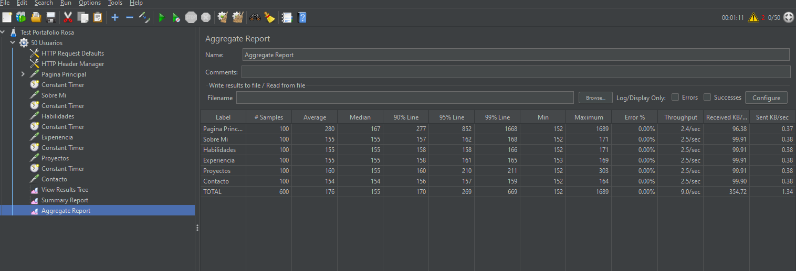
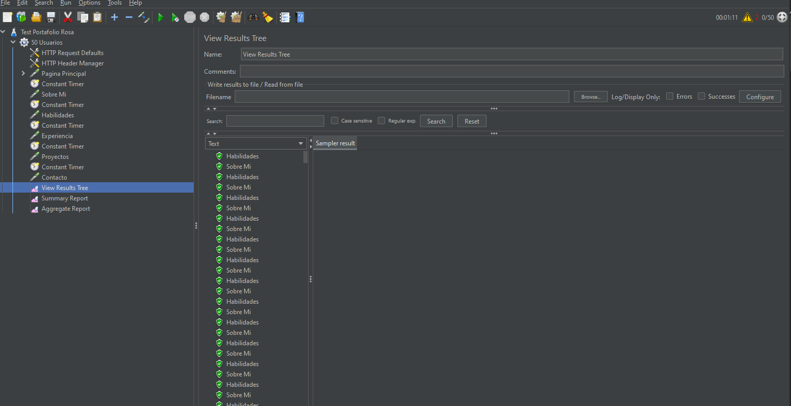
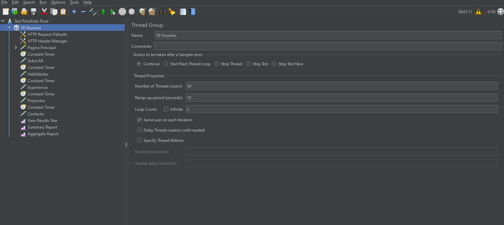

# Testing de Performance con JMeter - Portafolio Rosa Fuentes Gómez

Proyecto de pruebas de performance y carga utilizando Apache JMeter para validar el rendimiento, capacidad y estabilidad de mi portafolio personal.

## Sitio Web de mi portafolio testeado

**URL:** https://portafolio-rosafg.netlify.app/


## Objetivo del Proyecto

Demostrar competencias en:
- Performance Testing con Apache JMeter
- Análisis de métricas de rendimiento
- Identificación de cuellos de botella
- Documentación profesional de resultados
- Interpretación de datos de carga

## Tecnologías Utilizadas

- Apache JMeter 5.6.3
- Java 8+
- Netlify (hosting del sitio)

## Resultados Principales

### Resumen Ejecutivo

| Métrica | Resultado | Evaluación |
|---------|-----------|------------|
| **Tiempo Promedio** | 176ms |  Excelente |
| **Tasa de Errores** | 0.00% |  Perfecto |
| **Throughput** | 9.0 req/sec |  Muy Bueno |
| **Usuarios Concurrentes** | 50 |  Soportado |
| **Total Peticiones** | 600 |  Sin errores |

### Comparación con Estándares

Mi portafolio es **5 veces más rápido** que el estándar de la industria:
- **Estándar web:** 500-1000ms
- **Mi portafolio:** 176ms
- **Google recomienda:** < 2000ms

## Test Realizado

### Configuración

```
Tipo: Test de Carga
Usuarios: 50 concurrentes
Ramp-up: 10 segundos
Iteraciones: 2 por usuario
Duración: 71 segundos
Total Requests: 600
```

### Secciones Testeadas

1. Página Principal (/)
2. Sobre Mí (/#sobre-mi)
3. Habilidades (/#habilidades)
4. Experiencia (/#experiencia)
5. Proyectos (/#proyectos)
6. Contacto (/#Contacto)

## Resultados Detallados por Sección

| Sección | Samples | Average | Min | Max | Error% |
|---------|---------|---------|-----|-----|--------|
| **Página Principal** | 100 | 280ms | 152ms | 1689ms | 0.00% |
| **Sobre Mí** | 100 | 155ms | 152ms | 171ms | 0.00% |
| **Habilidades** | 100 | 155ms | 152ms | 171ms | 0.00% |
| **Experiencia** | 100 | 155ms | 153ms | 169ms | 0.00% |
| **Proyectos** | 100 | 160ms | 152ms | 303ms | 0.00% |
| **Contacto** | 100 | 154ms | 152ms | 164ms | 0.00% |
| **TOTAL** | 600 | 176ms | 152ms | 1689ms | 0.00% |

## Análisis Completo

Para ver el análisis completo de resultados, hallazgos y recomendaciones: **[HALLAZGOS.md](HALLAZGOS.md)**

## Capturas de Pantalla

### Summary Report


*Resumen general del test mostrando métricas principales*

### Aggregate Report


*Estadísticas detalladas incluyendo percentiles*

### View Results Tree


*Vista detallada de requests individuales*

### Configuración del Test


*Configuración del Thread Group con 50 usuarios*

## Estructura del Proyecto

```
portafolio-performance-testing/
├── jmeter/
│   └── test-portafolio-completo.jmx    # Test plan de JMeter
├── resultados/
│   └── capturas/                        # Screenshots de resultados
│       ├── jmeter-summary-report.png
│       ├── jmeter-aggregate-report.png
│       ├── jmeter-results-tree.png
│       └── jmeter-configuracion.png
├── HALLAZGOS.md                         # Análisis detallado
├── README.md                            # Este archivo
└── .gitignore                           # Archivos ignorados
```

## Cómo Ejecutar el Test

### Prerrequisitos

1. Tener instalado Apache JMeter 5.6+
2. Tener Java 8 o superior
3. Conexión a internet

### Ejecución desde GUI

```bash
# Abrir JMeter
jmeter.bat    # Windows
./jmeter.sh   # Linux/Mac

# Abrir el test
File > Open > jmeter/test-portafolio-completo.jmx

# Ejecutar
Click en botón "Start" (triángulo verde)

# Ver resultados
Click en "Summary Report" o "Aggregate Report"
```

### Ejecución desde Línea de Comandos (Recomendado)

```bash
# Navegar al directorio de JMeter
cd C:\apache-jmeter-5.6.3\bin

# Ejecutar test y generar reporte HTML
jmeter -n -t [ruta-al-test].jmx -l resultados.jtl -e -o reporte-html

# Abrir reporte
start reporte-html/index.html
```

## Conclusiones

### Puntos Fuertes

1. **Rendimiento Excepcional:** Tiempos de respuesta 5x mejores que el estándar
2. **Estabilidad Perfecta:** 0% de errores en 600 peticiones
3. **Escalabilidad:** Soporta 50+ usuarios sin degradación
4. **Consistencia:** Desviación estándar muy baja (2-3ms)
5. **CDN Eficiente:** Netlify CDN optimizado correctamente

### Capacidad Identificada

- **Usuarios simultáneos actuales:** 50 sin problemas
- **Capacidad estimada:** 100-150 usuarios
- **Tráfico diario:** Miles de visitantes

### Recomendaciones

El sitio tiene un rendimiento excepcional. Las únicas mejoras sugeridas son opcionales:
- Lazy loading de imágenes
- Optimización adicional de primera carga
- Service Workers para PWA

## Herramientas y Configuración

### Test Plan Configurado

- **Thread Group:** 50 usuarios
- **HTTP Request Defaults:** 
  - Protocol: https
  - Server: portafolio-rosafg.netlify.app
- **Constant Timers:** 1000ms entre requests
- **Assertions:** Response code 200
- **Listeners:** 
  - View Results Tree
  - Summary Report
  - Aggregate Report

### Listeners Utilizados

1. **View Results Tree:** Visualización detallada de cada request
2. **Summary Report:** Tabla resumen con métricas principales
3. **Aggregate Report:** Estadísticas avanzadas y percentiles

## Aprendizajes del Proyecto

Este proyecto demuestra:
- Diseño y ejecución de tests de performance
- Análisis e interpretación de métricas
- Documentación profesional de resultados
- Uso de herramientas estándar de la industria
- Metodologías de QA de performance

## Valor para Portfolio

Este proyecto complementa mi perfil de QA mostrando:
- **Testing Funcional:** Playwright (Python)
- **Testing de Performance:** JMeter (este proyecto)
- **Análisis de Datos:** Interpretación de métricas
- **Documentación:** Hallazgos profesionales

## Contacto

**Rosa Fuentes Gómez**
- **LinkedIn:** [linkedin.com/in/rosafg/](https://www.linkedin.com/in/rosafg/)
- **GitHub:** [github.com/RosaFg](https://github.com/RosaFg)
- **Email:** rosafuegos@gmail.com
- **Portfolio:** [portafolio-rosafg.netlify.app](https://portafolio-rosafg.netlify.app/)

## Licencia

MIT License - Libre para usar y modificar

---

**Desarrollado por Rosa Fuentes Gómez**  
QA Tester | Performance Testing | Apache JMeter  
Noviembre 2025
